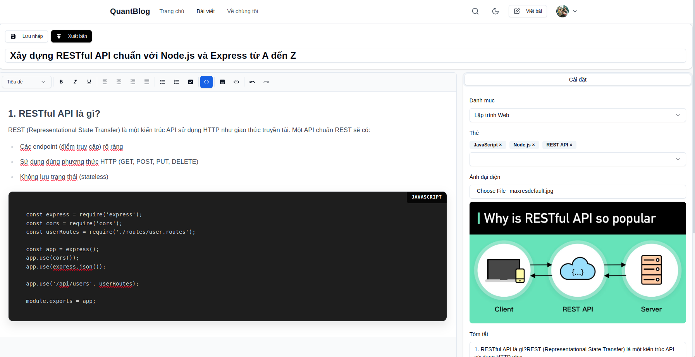
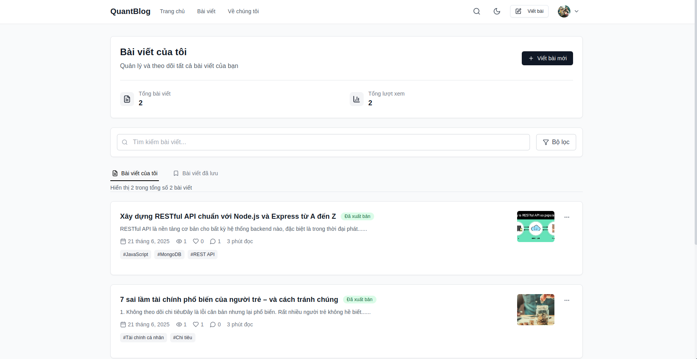
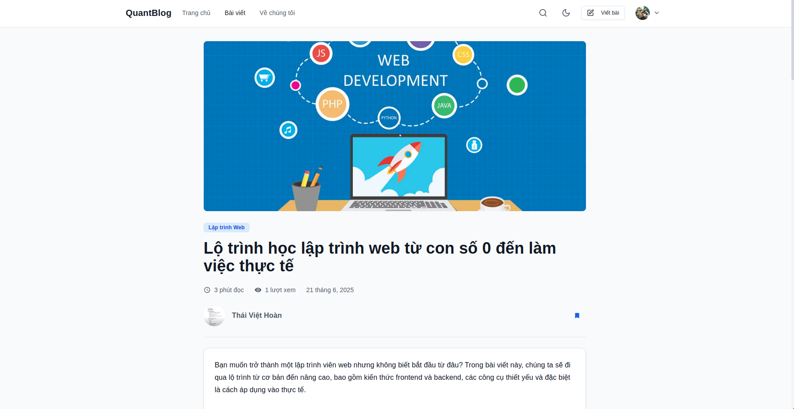
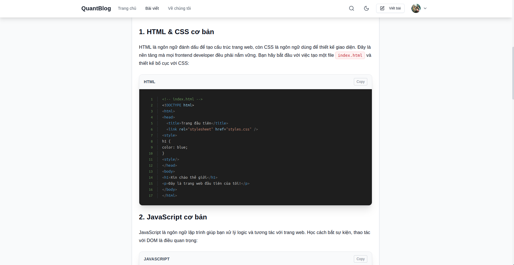
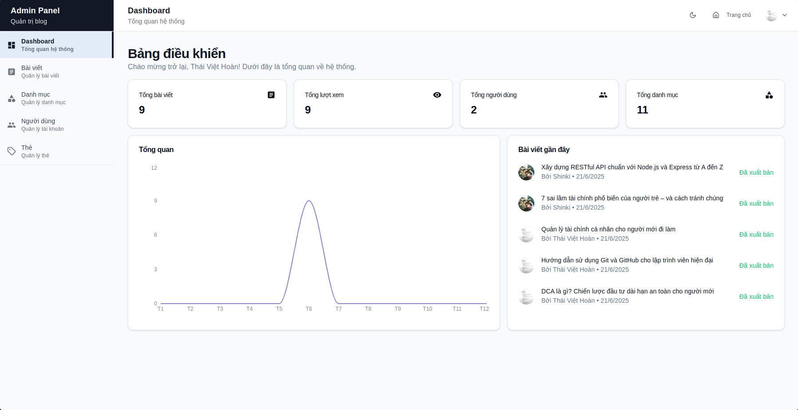
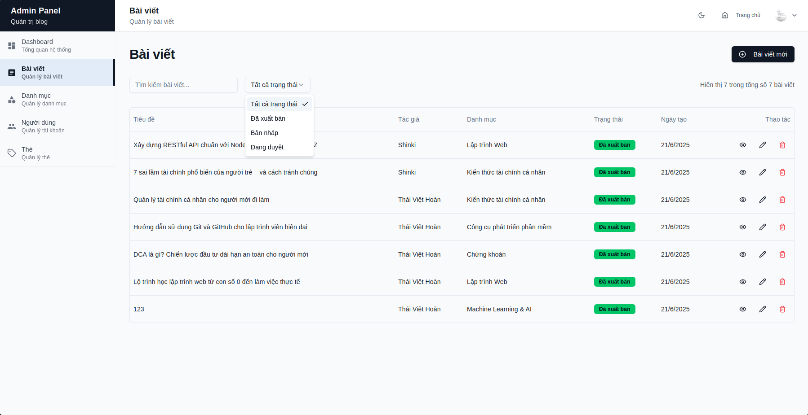

#  Quant Blog - Nền tảng viết Blog

## Tổng quan

**Quant Blog** là một nền tảng blog hiện đại được thiết kế để cung cấp trải nghiệm viết, đọc, tương tác với blog tối ưu. Dự án đảm bảo hiệu suất cao, bảo mật và khả năng mở rộng.

### Truy cập ứng dụng
https://quant-blog-ten.vercel.app

##  Screenshots & Demo

###  Trang chủ
- Giao diện với featured posts, recent posts, top posts
- Search và filter functionality
- Responsive design

###  Editor
- Rich text editor với TipTap
- Real-time preview
- Image upload và embed

### Quản lý bài viết
- Người dùng quản lý bài viết của mình

### Bài viết
- Xem bài viết

### Profile tác giả
- Xem thông tin tác giả và các bài viết

###  Admin Dashboard
- Quản lý Bài viết, người dùng, danh mục, thẻ, thống kê

##  Tính năng chính

###  Hệ thống xác thực & phân quyền
- **Đăng nhập/Đăng ký** với JWT Authentication
- **OAuth Google** integration
- **Phân quyền** theo vai trò (Admin, Author, Reader)
- **Session management** với Redis
- **Password hashing** với bcrypt

###  Quản lý nội dung
- **Rich Text Editor** với TipTap (WYSIWYG)
- **Markdown support** với syntax highlighting
- **Image upload** với Cloudinary integration
- **Draft/Publish workflow**
- **SEO optimization** (meta tags, OpenGraph, Twitter Cards)
- **Reading time calculation**

###  Hệ thống tổ chức nội dung
- **Categories** và **Tags** linh hoạt
- **Search functionality** với full-text search
- **Content filtering** và sorting
- **Related posts** suggestion

###  Tương tác người dùng
- **Comment system** với nested replies
- **Like/Unlike** posts
- **Save posts** cho sau
- **View tracking** và analytics
- **Real-time notifications**

###  Dashboard quản trị
- **Analytics dashboard** với Chart.js
- **User management**
- **Content moderation**
- **System monitoring**
- **Activity logs**

##  Công nghệ sử dụng

### Frontend
- **Framework**: Next.js 14 (App Router)
- **Language**: TypeScript
- **Styling**: Tailwind CSS + shadcn/ui
- **State Management**: Redux Toolkit
- **Rich Text Editor**: TipTap
- **Charts**: Chart.js + React-Chartjs-2
- **Forms**: React Hook Form + Zod validation
- **HTTP Client**: Axios

### Backend
- **Framework**: NestJS 11
- **Language**: TypeScript
- **Database**: PostgreSQL 16
- **ORM**: TypeORM
- **Cache**: Redis
- **Authentication**: JWT + Passport
- **File Upload**: Cloudinary
- **Email**: Nodemailer
- **API Documentation**: Swagger/OpenAPI

### DevOps & Tools
- **Containerization**: Docker + Docker Compose
- **Database Migration**: TypeORM migrations
- **Code Quality**: ESLint + Prettier
- **Testing**: Jest
- **Build Tool**: SWC (Super-fast bundler)

##  Performance & Optimization

### Frontend Optimization
- **Next.js Image Optimization**
- **Code Splitting** tự động
- **Static Site Generation** cho SEO
- **Service Worker** cho PWA
- **Bundle analysis** và optimization

### Backend Optimization
- **Database indexing** tối ưu
- **Redis caching** cho queries thường dùng
- **Connection pooling**
- **Query optimization** với TypeORM
- **Rate limiting** và security headers

##  Security Features

- **JWT Authentication** với refresh tokens
- **Password hashing** với bcrypt
- **CORS configuration**
- **Rate limiting**
- **Input validation** với class-validator
- **SQL injection prevention**
- **XSS protection**
