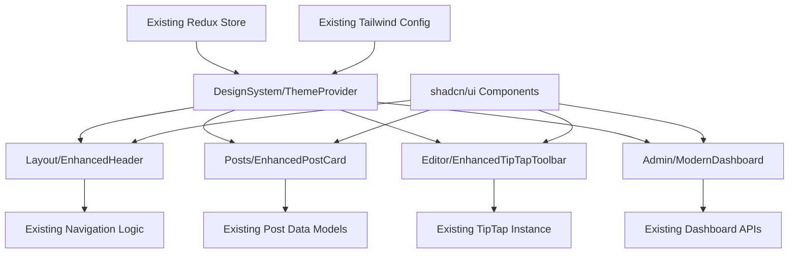

# Component Architecture

### New Components

#### DesignSystem/ThemeProvider
**Responsibility:** Enhanced theme management with design tokens and advanced color schemes
**Integration Points:** Integrates with existing Redux theme state and Tailwind config

**Key Interfaces:**
- `useDesignSystem()` hook for accessing design tokens
- `ThemeContext` extended with new color palettes and typography scales

**Dependencies:**
- **Existing Components:** Wraps existing ThemeProvider, integrates with Redux store
- **New Components:** Provides tokens to all enhanced UI components

**Technology Stack:** React Context + Tailwind CSS custom properties + Redux integration

#### Layout/EnhancedHeader
**Responsibility:** Modernized navigation with glass-morphism effects and improved mobile experience
**Integration Points:** Enhances existing Header.tsx with new visual design system

**Key Interfaces:**
- Same prop interface as existing Header component (backward compatible)
- New optional props for enhanced styling options

**Dependencies:**
- **Existing Components:** Builds upon current Header, maintains navigation logic
- **New Components:** Uses DesignSystem/ThemeProvider for consistent theming

**Technology Stack:** Next.js + Tailwind CSS + Framer Motion (for animations)

#### Posts/EnhancedPostCard
**Responsibility:** Improved post display with better visual hierarchy and engagement metrics
**Integration Points:** Enhances existing PostCard.tsx while maintaining data interface

**Key Interfaces:**
- Identical to existing PostCard props (seamless replacement)
- Enhanced visual presentation without API changes

**Dependencies:**
- **Existing Components:** Replaces PostCard.tsx, uses same post data models
- **New Components:** Leverages DesignSystem for consistent styling

**Technology Stack:** React + Tailwind CSS + Lucide icons

#### Editor/EnhancedTipTapToolbar
**Responsibility:** Polished editor toolbar with improved UX and accessibility
**Integration Points:** Enhances existing TipTap editor components

**Key Interfaces:**
- Compatible with existing TipTap editor instance
- Enhanced toolbar configuration options

**Dependencies:**
- **Existing Components:** Integrates with current TipTap setup and extensions
- **New Components:** Uses design system for consistent button styling

**Technology Stack:** TipTap + React + Tailwind CSS + Radix UI primitives

#### Admin/ModernDashboard
**Responsibility:** Redesigned admin interface with improved data visualization
**Integration Points:** Enhances existing dashboard components with better Chart.js styling

**Key Interfaces:**
- Same data interfaces as existing dashboard components
- Enhanced visual presentation for charts and tables

**Dependencies:**
- **Existing Components:** Builds upon current dashboard structure and data fetching
- **New Components:** Uses DesignSystem for consistent admin theming

**Technology Stack:** Chart.js + React + Tailwind CSS + shadcn/ui data tables

### Component Interaction Diagram


