# Information Architecture (IA)

### Site Map / Screen Inventory

```mermaid
graph TD
    A[Homepage] --> B[Posts/Articles]
    A --> C[Community/Q&A]
    A --> D[Categories]
    A --> E[User Profile]

    B --> B1[Browse All Posts]
    B --> B2[Featured Posts]
    B --> B3[Post Detail]
    B --> B4[Create/Edit Post]
    B --> B5[My Posts]

    C --> C1[All Questions]
    C --> C2[Question Detail]
    C --> C3[Ask Question]
    C --> C4[My Questions]
    C --> C5[My Answers]
    C --> C6[Users Directory]

    D --> D1[Trading Strategies]
    D --> D2[Blockchain/DeFi]
    D --> D3[Market Analysis]
    D --> D4[Technical Analysis]

    E --> E1[Profile View]
    E --> E2[Profile Settings]
    E --> E3[Notifications]

    F[Admin Dashboard] --> F1[Content Management]
    F --> F2[User Management]
    F --> F3[Analytics]
    F --> F4[Categories/Tags]

    G[Auth] --> G1[Login]
    G --> G2[Register]
    G --> G3[Password Reset]
```

### Navigation Structure

**Primary Navigation:** Horizontal header with: Home | Posts | Community | Categories
- Sticky navigation with search functionality
- User menu with profile, settings, notifications

**Secondary Navigation:**
- Sidebar filters for Posts (category, tags, date)
- Q&A sidebar with sorting options (newest, most voted, unanswered)
- Breadcrumb for deep navigation in categories

**Breadcrumb Strategy:** Always display path: Home > Category > Subcategory > Post Title
- Clickable breadcrumbs for easy back-navigation
- Schema markup for SEO benefits

