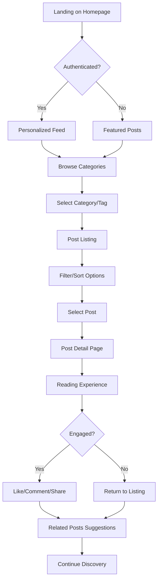
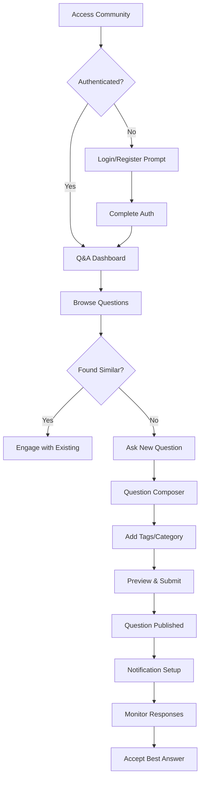

# User Flows

### Content Discovery & Reading

**User Goal:** Find and read articles about trading strategies or market analysis

**Entry Points:**
- Homepage hero section
- Direct category navigation
- Search results
- Social media shares

**Success Criteria:** User finds relevant content and completes reading with engagement (like, comment, share)

#### Flow Diagram:

#### Edge Cases & Error Handling:
- Content paywall for premium articles → Clear upgrade CTA
- Broken images/charts → Fallback placeholders with retry options
- Slow loading → Progressive loading with skeleton screens
- Mobile reading → Responsive typography and touch-optimized controls

### Community Q&A Interaction

**User Goal:** Ask questions about trading strategy and receive answers from community

**Entry Points:**
- Community section from main nav
- "Ask Question" CTA on post pages
- Q&A sidebar recommendations

**Success Criteria:** Question is posted successfully and receives at least 1 quality answer

#### Flow Diagram:

#### Edge Cases & Error Handling:
- Duplicate questions → Suggest similar existing questions
- Insufficient detail → Inline guidance for better questions
- Spam prevention → Rate limiting and community moderation
- No responses → Automated follow-up suggestions

